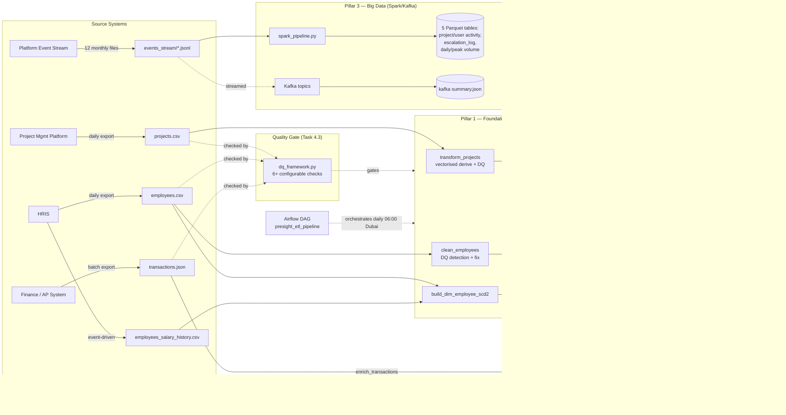

# Presight Data Governance Document

**Author:** Baiju Mohan · **Date:** 2026-08-20 · **Scope:** `projects`, `employees`, `transactions`, `employees_salary_history`

---

## Section 1 — Data Inventory

| Dataset | Source system | Format | Update frequency | Volume estimate | Daily growth |
|---|---|---|---|---|---|
| projects | Project Management Platform (operational DB export) | CSV | Daily batch export | 500 rows, ~80 KB | ~1-3 new projects/day (estimate, based on a mid-size PM org running ~500 concurrent/historical projects) |
| employees | HRIS (Human Resources Information System) | CSV | Daily batch export | 1,000 rows, ~130 KB | Low — a handful of hires/status changes per week, not per day |
| transactions | Finance/AP (Accounts Payable) system | JSON | Near-real-time / daily batch | 50,000 rows, ~10 MB | ~130-150 new transactions/day at current volume (50,000 rows over the observed ~2022-01 to 2026-08 date range) |
| employees_salary_history | HRIS payroll module | CSV | Event-driven (on hire/promotion/raise), reconciled to a daily export | ~1,826 rows | Low — one new row per salary/role change event, not a daily volume driver |

**Why this matters operationally:** transactions is the only dataset with meaningful daily growth — it's the one that needs incremental/append-only loading logic (not full-refresh) once volumes grow past what a daily full CSV/JSON re-export can handle. See Section 6 (lineage) for where that would slot in.

---

## Section 2 — Data Classification

Classification levels (as defined in the task brief):

| Level | Definition |
|---|---|
| **Public** | Non-sensitive, shareable externally |
| **Internal** | Internal use only, no regulatory requirement |
| **Confidential** | Sensitive business data — restricted access |
| **Personal (PII)** | Personally identifiable information — regulatory requirements apply |

### projects.csv

| Column | Classification | Notes |
|---|---|---|
| project_id, project_name | Internal | Project identifiers/names — internal operational data |
| department, region, priority, status | Internal | Operational metadata |
| start_date, end_date | Internal | |
| budget, actual_cost | **Confidential** | Financial figures — competitively sensitive, restricted to Finance/PM/Exec |
| project_manager_id | Internal | Foreign key to employees — becomes PII only when joined to `employees.full_name` |

### employees.csv

| Column | Classification | Regulation (if PII) |
|---|---|---|
| employee_id | Internal | Surrogate identifier alone, not personal data |
| full_name | **PII** | GDPR (name = direct identifier) + UAE PDPL |
| email | **PII** | GDPR + UAE PDPL |
| department, role, level, region, status | Internal | |
| hire_date | Internal | Not personal data on its own, but combined with other fields contributes to re-identification risk |
| salary | **Confidential / PII** | Compensation tied to a named, identifiable employee — UAE PDPL's definition of "personal data" is broad enough to cover this in combination with employee_id/full_name; GDPR treats it as personal data under Art. 4(1) for the same reason. Also independently Confidential as sensitive business data. |
| manager_id | Internal | FK, becomes PII only when resolved to a name |
| years_experience | Internal | Low sensitivity on its own |

### transactions.json

| Column | Classification | Notes |
|---|---|---|
| transaction_id, invoice_ref | Internal | |
| project_id, vendor_id, vendor_name | Internal | Vendor names could be Confidential in aggregate (reveals vendor spend concentration — see Q3) but individual vendor names are not PII |
| category, currency, payment_status | Internal | |
| amount | **Confidential** | Financial data |
| transaction_date | Internal | |
| approved_by | **PII (indirect)** | Employee ID resolves to a named individual via employees.csv — the join is what creates the PII exposure, not the column alone |
| notes | Internal → **potentially Confidential/PII** | Free-text field; flagged as a governance risk area (see below) — free text can accidentally contain names, amounts, or other sensitive detail not captured by column-level classification. Recommend a periodic sampling audit of `notes` content. |

### employees_salary_history.csv

| Column | Classification | Regulation (if PII) |
|---|---|---|
| employee_id | Internal | |
| previous_salary, new_salary | **Confidential / PII** | Same reasoning as employees.salary, plus this is *historical* compensation — arguably more sensitive since it reveals someone's trajectory/raise pattern over time |
| previous_role, new_role, previous_level, new_level | Internal | |
| effective_date | Internal | |
| change_type, change_reason | **Confidential** | `change_reason` free-text can reveal sensitive HR context (e.g. performance-related reasoning) — treat as HR-restricted even though not classic PII |

**PII summary:** `employees.full_name`, `employees.email` are direct PII under both **GDPR** and **UAE PDPL**. `employees.salary`, `employees_salary_history.{previous,new}_salary`, and `transactions.approved_by` (once joined to a name) are PII-adjacent/Confidential — sensitive personal data whose regulatory weight comes from the *combination* with an identifiable individual, which is exactly the pattern both GDPR and PDPL are designed to catch (identifiability through combination, not just a single "obviously personal" column).

---

## Section 3 — Data Ownership

| Dataset | Data Owner (role) | Data Steward (role) | Access approver |
|---|---|---|---|
| projects | Head of Project Management Office (PMO) | Data Engineering Lead | PMO Director |
| employees | Head of HR | HR Systems Analyst | Head of HR |
| transactions | Head of Finance | Finance Data Analyst | Finance Director |
| employees_salary_history | Head of HR (jointly with Finance/Payroll) | HR Systems Analyst | Head of HR + Finance Director (dual approval) |

**Owner vs. Steward, in my own words:** the **Data Owner** is accountable for the data — they answer for why it exists, what business decisions depend on it, and they're the one who signs off on policy questions like "can this be shared externally" or "how long do we keep it." The **Data Steward** is the operational custodian — the person who actually knows the schema, fixes data quality issues, manages day-to-day access requests, and executes the retention/disposal policy the Owner has approved. In short: the Owner sets the *what/why*, the Steward handles the *how*. On a small team these can be the same person, but keeping the roles conceptually separate matters once the org grows — it's the difference between "who's accountable" and "who's doing the work."

---

## Section 4 — Retention Policy

| Dataset | Retention period | Justification | Disposal method | Who enforces |
|---|---|---|---|---|
| projects | 7 years after project closure | Standard business-record retention for contract/audit purposes (aligns with UAE commercial record-keeping norms and typical audit windows) | Archive (cold storage) after 2 years active, delete after 7 | Data Engineering (automated lifecycle policy) |
| employees | Duration of employment + 7 years post-departure | UAE Labour Law and common HR audit practice require retaining employment records for a period after termination for potential labour disputes | Anonymise direct identifiers (name, email) after the retention window, retain aggregated fields for historical HR analytics; full delete after an additional legal hold buffer if no dispute is open | HR + Data Engineering |
| transactions | 5 years | UAE tax law (VAT-related record-keeping) generally requires financial records to be retained for a multi-year window for audit purposes; 5 years is a conservative floor for this class of financial transaction record | Archive to cold storage after 1 year active, delete after 5 (subject to Finance sign-off per audit cycle) | Finance + Data Engineering |
| **employees_salary_history** | **Employment duration + 10 years post-departure** (longer than the base employee record) | **Special consideration** (see below) | Anonymise employee_id linkage after the window (keep aggregate compensation trend data for benchmarking, strip the identifying key); full delete only after legal hold clears | HR + Finance (dual sign-off, given payroll/tax relevance) |

**Special consideration — employees_salary_history.csv:** this dataset needs a *longer* retention window than the base `employees` table, for two compounding reasons: (1) **UAE labour law** wage-record obligations, and (2) **tax/payroll audit** requirements, since historical salary changes are the underlying evidence for payroll tax filings and can be requested in a labour dispute or tax audit years after the fact. I've set this to employment duration + 10 years (vs. +7 for the base employee record) — the extra buffer specifically accounts for the payroll/tax angle, which the base employee record doesn't carry. This is a policy recommendation, not a legal citation — actual retention periods should be confirmed with Legal/Compliance against the current UAE Federal Labour Law and Federal Tax Authority requirements at implementation time, since these figures are illustrative defaults for this assessment rather than verified current statute.

---

## Section 5 — Access Control

Access levels: `None`, `Read`, `Read + Write`, `Full (including delete)`

| Persona | Projects | Employees | Transactions | Salary History |
|---|---|---|---|---|
| Data Engineer | Read + Write | Read + Write | Read + Write | **Read** (pipeline needs it for SCD2 builds, not ad-hoc browsing — see justification) |
| BI Analyst | Read | Read (excl. salary column) | Read | **None** |
| Finance Team | Read | None | Read + Write | **Read** (payroll reconciliation only) |
| HR Team | None | Read + Write | None | Read + Write |
| Executive | Read | Read (aggregated only, no row-level salary) | Read (aggregated only) | **None** |

**Justification (least privilege):**

- **Salary History is the most locked-down dataset by design.** Most personas get `None` — BI Analysts and Executives should consume salary *trends* through pre-aggregated, anonymised reporting layers (e.g. "median salary by level/department"), never row-level history tied to a named employee. Only HR (full read/write, it's their system of record) and Finance (read-only, for payroll reconciliation) touch it directly.
- **Data Engineer gets Read, not Read+Write, on Salary History** — the pipeline needs to *read* it to build the SCD2 `dim_employee` table (Task 1.2), but engineers should never be writing directly into HR's system-of-record salary data; any correction goes through HR's own tooling, not a pipeline credential. This is the one place I deliberately gave Data Engineering less access than the "engineers need broad access" instinct would suggest — it's the dataset where over-provisioning is the least defensible.
- **BI Analyst excludes the `salary` column on employees** even though they get row-level Read elsewhere — column-level masking, not just table-level access, is needed here since `employees.salary` is Confidential/PII per Section 2 but the rest of the row (department, role, region) is legitimate BI material.
- **Executive gets aggregated-only** on Transactions/Employees rather than raw Read — an executive dashboard (Task 2.4) needs KPI-level numbers, not row-level browsing capability, which is both a least-privilege call and reduces the blast radius if an executive's credentials are compromised.
- **Finance Team has no access to Employees** beyond what Transactions already exposes via `approved_by` (a foreign key, not a name) — Finance doesn't need HR's employee master data to do transaction reconciliation.

---

## Section 6 — Data Lineage

**Where transformations happen:** all cleaning/derivation logic lives in `etl_pipeline.py` (Pillar 1) and `etl_full.py` (Pillar 2) — raw source files are never mutated in place, every transform reads a raw/clean input and writes a new output.

**Where quality checks are applied:** `dq_framework.py` (Task 4.3) runs against the *raw* extracts before the transform stage — this is deliberately a gate (see the Airflow DAG's `validate_data_quality` task), not a post-hoc report; the pipeline stops rather than loading data that fails a critical completeness check.
