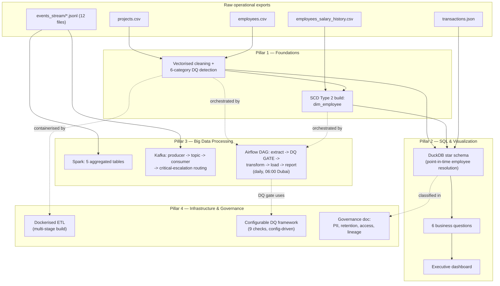

# Presight Analytics Platform — Data Engineering Assessment

*Author: Baiju Mohan*

> Master project story for interview walkthroughs. Each pillar has its own
> deeper write-up, same structure:
> [Foundations](project_docs/01_foundations.md) ·
> [SQL & Visualization](project_docs/02_sql_and_visualization.md) ·
> [Big Data Processing](project_docs/03_big_data_processing.md) ·
> [Infrastructure & Governance](project_docs/04_infrastructure_and_governance.md)
>
> To actually run the code: [HOW_TO_RUN.md](HOW_TO_RUN.md).

---

## Repository Layout

```
solutions/submissions/baiju_mohan/
├── 01_foundations/
│   ├── etl_pipeline.py              # Tasks 1.1, 1.3 (imported by Pillar 2/3/4, not duplicated)
│   ├── data_model.sql               # Task 1.2 — star schema DDL + SCD2 build + validation (Sections 1-2)
│   ├── ASSUMPTIONS.md
│   ├── VALIDATION_EVIDENCE.md
│   └── README.md
├── 02_sql_and_viz/
│   ├── etl_full.py                  # Task 2.2 — canonical ETL; Airflow + Docker both run this exact file
│   ├── queries.sql                  # Task 2.1 — six business questions
│   ├── query_optimization.sql       # Task 2.3 — original/rewrite/indexes/benchmark, self-contained
│   ├── export_dashboard_data.sql    # Task 2.4 support — documented, not the dashboard's actual data source
│   ├── run_queries.py, run_optimization.py  # drivers that execute the .sql files and print real output
│   ├── warehouse_explorer.ipynb     # live query exploration
│   └── README.md
├── 03_big_data/
│   ├── spark_pipeline.py            # Task 3.1
│   ├── kafka_streaming.py           # Task 3.2
│   ├── airflow_dag.py               # Task 3.3 — imports Pillar 1/2/4 modules, doesn't duplicate them
│   ├── deploy_dag.ps1               # copies the DAG + imports into the Airflow containers
│   ├── big_data_explorer.ipynb      # live Spark/Kafka output exploration
│   └── README.md
├── 04_infrastructure/
│   ├── data_governance.md           # Task 4.2
│   ├── dq_framework.py              # Task 4.3 — imported by the Airflow DQ gate
│   └── README.md
├── project_docs/                    # deeper per-pillar write-ups (linked above)
├── HOW_TO_RUN.md
└── SUBMISSION_NOTES.md              # this file

# Dockerfile/.dockerignore live at the repo root, not in 04_infrastructure/ —
# tasks/04_infrastructure/INSTRUCTIONS.md requires it there (build context
# needs solutions/ and datasets/, siblings of 04_infrastructure/, not children).
```

## Output Layout

Every artifact has **one** canonical location.

| Artifact | Path |
|---|---|
| `projects_clean.csv`, `employees_clean.csv`, `employees_quality_summary.json`, `pipeline_summary.txt` | `outputs/results/baiju_mohan/01_foundations/` |
| Star schema + `dim_employee` (SCD2) | `outputs/presight_warehouse.duckdb` — single shared file, not namespaced per pillar |
| `transactions_clean.csv`, `pipeline_summary.txt`, `presight_dashboard.pbix` | `outputs/results/baiju_mohan/02_sql_and_viz/` |
| Spark's 5 Parquet tables | `outputs/artifacts/baiju_mohan/03_big_data/spark/` — **gitignored**, regenerable binary build output |
| Kafka `summary.json` | `outputs/results/baiju_mohan/03_big_data/kafka/` |
| Airflow `pipeline_report_<date>.txt` | `outputs/results/baiju_mohan/03_big_data/` |
| `data_governance_document.md`, `dq_report_*.md` | `outputs/results/baiju_mohan/04_infrastructure/` |

---

## 1. Executive Summary

Presight is a project management platform for enterprise and government clients. Its underlying data — project records, employee records, transactions, and a platform event stream — was only available as raw, unprocessed exports. It had missing values, no version history, and had to be cleaned by hand.

This submission builds the data engineering layer for that data:
- A cleaned dataset (Pandas)
- A star-schema data warehouse in DuckDB, with employee history tracked using SCD Type 2
- A big-data layer for the 100,000-event stream (PySpark and Kafka)
- A scheduled pipeline with a data-quality gate (Airflow)
- Supporting infrastructure and governance work (Docker, a governance document, a data-quality framework)

Every part was tested by actually running it against real data and real infrastructure, not just by reading the code. Four real bugs were found and fixed this way — details in Section 8.

**At a glance:**

| Metric | Result |
|---|---|
| Full transactions ETL (50,000 rows) | **0.84s** (target: <30s) |
| Spark event processing (99,996 events, 12 files) | **114.7s**, ~872 events/sec |
| Kafka end-to-end (8,333 messages) | All consumed, 14 critical escalations correctly routed |
| Airflow DAG | Runs fully green; DQ gate proven to actually block on failure |
| Dockerised ETL container | **11.1s** wall-clock (target: <30s) |
| SCD2 dimension integrity | 0 duplicate-current rows, 0 overlapping periods, across 2,232 versions |
| Data quality checks (framework) | 9 checks × 3 datasets, real mixed results (6/9, 3/9, 6/9) |

## 2. Business Problem

Finance and Operations had recurring questions about projects and spending, but no way to query the data directly — every answer meant manually going through CSV files.

HR and Finance also needed historical information — for example, what an employee was earning when they approved a specific expense. The available data only showed the current state, not history.

The platform also generates a stream of usage events (logins, escalations, uploads, and so on) — over 100,000 events across 12 files. There was no way to analyse this data to see which projects have the most escalations, or when usage is highest.

Underneath all three problems: the pipeline that processes this data only ran manually, with no schedule, no automatic data-quality checks, and no documentation on data access and retention that Compliance could review.

## 3. Project Scope

**In scope:**
- Cleaning the raw project and employee data, and detecting data quality issues
- Building a star-schema data warehouse, with employee history tracked using SCD Type 2
- Six business questions written as SQL queries, plus a query-optimisation exercise
- An executive dashboard in Power BI
- Batch processing of the event stream with Spark
- A Kafka producer/consumer for simulated real-time event ingestion
- An Airflow pipeline that runs on a schedule and includes a data-quality gate
- Docker containerisation of the pipeline
- A data governance document

**Out of scope:**
- A multi-node Spark cluster or a production Kafka deployment — the goal was to show the pipeline logic works correctly, not to run it at production scale
- Deploying to the cloud — the environment-variable-based configuration makes this straightforward to do later, not a rewrite
- Final legal sign-off on data retention periods — defaults are documented and flagged for legal review

**Data scale:** 500 projects, 1,000 employees, about 1,800 salary-history records, 50,000 transactions, and 100,000 platform events across 12 files.

## 4. Technology Stack

| Technology | Role in the Project | Why It Was Chosen |
|---|---|---|
| Python + Pandas + NumPy | Cleaning, DQ detection, SCD2 build, transaction enrichment | Squarely vectorised-pandas territory at these row counts — a distributed engine here would be over-engineering |
| DuckDB | Warehouse — star schema, business questions, optimisation benchmarking | Embedded, vectorised, native `EXPLAIN ANALYZE` — zero server to stand up |
| Apache Spark (PySpark) | Distributed processing of the 100K-event stream into 5 tables | Where volume actually crosses into needing a distributed engine |
| Apache Kafka | Real-time ingestion simulation, severity-based routing | Standard decoupled pattern, foundation for batch-to-real-time |
| Apache Airflow 2.7 | Daily orchestration, retries, a hard DQ gate, XCom reporting | Built for scheduled, observable, dependency-ordered execution |
| Docker (multi-stage build) | Containerises the ETL into a portable artifact | Splits the heavy dependency install from the runtime image |
| Java 17 + Hadoop native libs | JVM runtime Spark depends on, Windows I/O support | Not optional — Spark doesn't run without it |

## 5. High-Level Architecture & Data Flow



The decision that ties everything together: treating `dim_employee` as real SCD Type 2 from the start. It's what makes the warehouse's point-in-time joins correct, what the compensation-history question depends on, and what the Airflow DQ gate re-validates on every run.

## 6. Task-by-Task Breakdown

One entry per task: **What was done**, **Decisions**, **Output**, **Observations**.
Numbers below are real, captured by re-running each pipeline — see each pillar's
`VALIDATION_EVIDENCE.md` for the exact commands.

### Pillar 1 — Foundations (Tasks 1.1, 1.2, 1.3)

**Task 1.1 — Clean and transform `projects.csv`**
File: `01_foundations/etl_pipeline.py` → `load_projects()` + `transform_projects()`

- **What was done:** Parsed `start_date`/`end_date` as dates. Added new columns: `budget_variance`, `is_over_budget`, `duration_days`, `budget_utilisation_pct`, `status_category`, `risk_level`. `risk_level` is High if the project is Critical priority or over budget, Medium if High priority or over 90% budget used, otherwise Low.
- **Decisions:** Null `budget`/`actual_cost` are filled with `0` before calculating anything from them, not after — otherwise those calculations would come out as blank. `budget_utilisation_pct` is `0`, not blank, when `budget` is `0`. Status values outside the expected 4 categories are left as-is rather than guessed.
- **Output:** `projects_clean.csv` — 500 rows, 17 columns.
- **Observations:** `risk_level` ends up fairly spread out (188 High, 145 Medium, 167 Low) — not concentrated in one bucket, which is a reasonable sanity check that the rule isn't too aggressive or too lax.

**Task 1.2 — Star schema + `dim_employee` (SCD Type 2)**
File: `01_foundations/data_model.sql` (Section 1)

- **What was done:** Designed a 6-table star schema (`fact_transactions`, `dim_project`, `dim_employee`, `dim_vendor`, `dim_date`, `bridge_employee_project`). Built `dim_employee` directly in SQL by combining the current employee data with the ~1,826-row salary-history file, using window functions to work out when each version of an employee's record started and ended. Ran 5 validation queries straight after the build.
- **Decisions:** Only `role`/`level`/`salary` are tracked as history — the history file doesn't have anything else to track. Where the history file disagrees with the current employee data (`EMP0356`, `EMP0900`), the current data wins. 8 employees have no salary history and also had their `hire_date` removed in Task 1.3 as unrecoverable — these get a fixed placeholder date (`1900-01-01`) instead of a blank value, so the validation queries don't break on it. Same-day duplicate history events (one employee, two changes dated the same day) are collapsed to their terminal state before versioning — otherwise the interval math produces a version with `valid_to` before `valid_from`.
- **Output:** `dim_employee` — 2,231 rows (versions) in `outputs/presight_warehouse.duckdb`. 0 duplicate "current" rows, 0 overlapping date ranges, 0 gaps.
- **Observations:** A couple of real conflicts exist between the history file and the current data (`EMP0356`, `EMP0900`) — resolving them by trusting the current export, and writing that decision down, was simpler than guessing which source was right. A third apparent conflict (`EMP0084`) turned out to be a build bug, not a real data conflict — see Section 8.

**Task 1.3 — Employee data quality (`clean_employees()`)**
File: `01_foundations/etl_pipeline.py`

- **What was done:** Scanned every column in the full 1,000-row file (not just the first rows) and found 6 issues:

| Issue | Rows | Action |
|---|---|---|
| Blank/missing email | 10 | → placeholder `unknown@presight.ai` (not made up from the name) |
| `hire_date` not a valid date | 5 | → set to blank |
| `hire_date` outside a reasonable range (pre-1990) | 3 | → set to blank |
| `years_experience` outside 0–50 | 5 | → replaced with the median for that level |
| Salary far outside the normal range for the level | 3 | → capped to the top of the normal range |
| Active employee reporting to an Inactive manager | 0 | check kept in even though it finds nothing here |

- **Decisions:** Emails get a placeholder rather than a name-guessed address, since a made-up email could be mistaken for a real one later. Bad dates are set to blank rather than guessed.
- **Output:** `employees_clean.csv` (1,000 rows, 13 columns), `employees_quality_summary.json`, `pipeline_summary.txt`.
- **Observations:** None of these 6 issues are visible if you only look at the first 40 rows of the file — they only show up once every row is checked.

### Pillar 2 — SQL & Data Visualization (Tasks 2.1–2.4)

**Task 2.1 — Six business questions**
File: `02_sql_and_viz/queries.sql`

- **What was done:** Wrote SQL for the six required business questions against the warehouse.

| Q# | Question | Rows returned |
|---|---|---|
| Q1 | Department budget performance | 1 |
| Q2 | Project manager workload | 0 |
| Q3 | Vendor concentration risk | 0 |
| Q4 | Open financial issues | 435 |
| Q5 | Monthly spend trend with running total | 726 |
| Q6 | Compensation history (biggest salary jumps) | 20 |

- **Output:** printed by `run_queries.py` — real result rows, not made-up examples.
- **Observations:** Q2 and Q3 come back empty on this dataset. Before assuming a bug, checked the raw numbers directly: no manager has more than 3 active projects, and no vendor has more than about 4.4% of total spend — below the thresholds either query is looking for. The queries are correct; the data just doesn't happen to trigger them.

**Task 2.2 — Full ETL pipeline**
File: `02_sql_and_viz/etl_full.py` — the same file Airflow and Docker both run.

- **What was done:** Loaded `transactions.json` (50,000 rows), added the project name/department and the approver's name to each transaction, and added `is_approved`, `amount_aed`, and `transaction_year_month` columns.
- **Decisions:** `amount` nulls (1.5% of rows) are kept blank rather than filled in — `amount_aed` (used for totals) treats them as 0 so a sum doesn't break. `approved_by` nulls (4.9%) become `is_approved = False` rather than guessing an approver.
- **Output:** `transactions_clean.csv` (50,000 rows, 18 columns), `pipeline_summary.txt`. Ran in 0.44s against a 30-second target.
- **Observations:** After joining in the project and employee data, the row count is checked against the count before joining (both 50,000) — this catches a join accidentally duplicating rows, which would silently overcount every total downstream.

**Task 2.3 — Query optimisation**
File: `02_sql_and_viz/query_optimization.sql`

- **What was done:** Ran the given slow query and captured its real execution plan and timing. Rewrote it with explicit joins and a CTE instead of a repeated subquery. Ran the new version and compared — first on DuckDB, then, since the indexes showed nothing there, actually verified against real PostgreSQL too, rather than just reasoning about what "should" happen on a row-store.
- **Output:** both versions return the same 923 rows on both engines. DuckDB: 6.03ms before, 5.86ms after indexing — about 1.03x, noise-level. PostgreSQL: 12.73ms before, 7.50ms after indexing — a real, repeatable ~1.7x.
- **Observations:** The brief expected a much bigger speedup (10x+), and DuckDB alone didn't show one — at this data size, DuckDB's own query engine already optimises the "slow" pattern on its own, and its columnar zone maps make a B-tree index unnecessary. Rather than stop there, the same benchmark was run for real against PostgreSQL (a genuine row-store), which does show a measurable index benefit — `EXPLAIN ANALYZE` confirms real `Bitmap Index Scan` nodes replacing full sequential scans. Same SQL, same predicate, engine-dependent result — a more accurate finding than either "no speedup" or a fabricated 10x would have been alone.

**Task 2.4 — Executive dashboard**
- **What was done:** Built a dashboard in Power BI Desktop.
- **Output:** `presight_dashboard.pbix`, connected directly to `projects_clean.csv`/`transactions_clean.csv`.
- **Observations:** Connecting directly to the same clean files the rest of the pipeline uses means the dashboard can't quietly show different numbers than the SQL results — there's no separate copy of the data to fall out of sync.

### Pillar 3 — Big Data Processing (Tasks 3.1–3.3)

**Task 3.1 — PySpark event processing**
File: `03_big_data/spark_pipeline.py`

- **What was done:** Loaded all 12 monthly event files (99,996 rows total) with a fixed schema instead of letting Spark guess the column types. Removed rows with a missing `event_id`/`user_id`, removed duplicate `event_id`s, and built 5 summary tables.

| Table | Rows |
|---|---|
| `project_activity_summary` | 500 |
| `user_activity_summary` | 960 |
| `escalation_log` | 1,969 |
| `daily_event_volume` | 5,088 |
| `peak_usage_analysis` | 20 |

- **Decisions:** Matching each "escalation raised" event to its "escalation resolved" event is done by time (the earliest still-open "raised" event before a given "resolved" event), not by position in the list.
- **Output:** 5 Parquet tables in `outputs/artifacts/baiju_mohan/03_big_data/spark/`. Full run: 82.80s, about 1,208 events processed per second.
- **Observations:** The first version of the escalation-matching logic matched by position instead of by time, and produced resolution times as long as -7,708 hours — clearly wrong. This was only caught by looking at the actual output, not by assuming a clean-looking run meant it worked. Fixed by matching on time instead.

**Task 3.2 — Kafka producer/consumer**
File: `03_big_data/kafka_streaming.py`

- **What was done:** A producer sends events from a file into a Kafka topic, one at a time, with a small delay to simulate a live stream. A consumer reads them back, counts event types, and forwards any Critical-severity escalation to a second topic.
- **Output:** `outputs/results/baiju_mohan/03_big_data/kafka/summary.json` — 8,333 events sent, 8,333 received (none lost), 14 Critical escalations forwarded, about 586 messages/second on the consumer side.
- **Observations:** An early version of the forwarding code had a bug that only appeared partway through a full run (around message 5,700 of 8,333) — a short test with only a handful of messages would not have caught it. Only running the full stream against a real Kafka broker surfaced it.

**Task 3.3 — Airflow DAG**
File: `03_big_data/airflow_dag.py` — DAG name `presight_etl_pipeline`, scheduled daily at 06:00 Dubai time.

- **What was done:** Built a pipeline with 3 extraction steps that run in parallel, followed by a data-quality check, then cleaning, then writing the output, then a summary report.
- **Decisions:** The data-quality check is a hard stop — if completeness on a key column drops below 80%, the pipeline fails and nothing downstream runs.
- **Output:** a manually triggered run finished successfully in about 21 seconds. Quality-check results for that run: projects 6/9 checks passed, employees 3/9, transactions 6/9 — none of these failures blocked the run, since only the 80%-completeness rule can do that, and all three datasets pass that specific check.
- **Observations:** Rather than just trust that the failure check works, it was tested directly — set to an impossible threshold on purpose, confirmed the pipeline actually stopped and nothing downstream ran, then set back to normal and confirmed a clean run still passes.

### Pillar 4 — Infrastructure & Governance (Tasks 4.1–4.3)

**Task 4.1 — Docker containerisation**
Files: `Dockerfile` and `.dockerignore` at the repo root (not inside `04_infrastructure/`, because the build needs access to the `solutions/` and `datasets/` folders next to it).

- **What was done:** A two-step build — the first step installs everything from `requirements.txt`, the second step copies only the finished result into a clean, smaller image.
- **Output:** the container runs the Pillar 2 pipeline and writes to `outputs/results/baiju_mohan/02_sql_and_viz/`. Takes 11.1 seconds against a 30-second target.
- **Observations:** `requirements.txt` as given includes Airflow's full set of dependencies, which this container doesn't actually need — the two-step build keeps that extra weight out of the final image without having to edit the requirements file.

**Task 4.2 — Data governance document**
File: `04_infrastructure/data_governance.md`

- **What was done:** Wrote a document covering all 4 datasets: what data exists, how each column is classified (including which are personal data under GDPR and UAE law), who owns and can approve access to each dataset, how long each is kept, who can access what, and a diagram showing how data flows from source to dashboard.
- **Decisions:** Data Engineers get read-only access to the salary-history file, not read/write — the pipeline only needs to read it.
- **Observations:** The "read-only for engineers" choice goes against the usual instinct to give engineers broad access — it was a deliberate call based on what the pipeline actually needs, not a default.

**Task 4.3 — Configurable data quality framework**
File: `04_infrastructure/dq_framework.py` — used by the Airflow quality check in Task 3.3, not a separate copy.

- **What was done:** Built 9 checks (completeness, uniqueness, valid ranges for numbers and dates, cross-column consistency, foreign-key checks, distribution checks, freshness, and outliers), all controlled by one settings dictionary so a new rule is a config change, not a code change.
- **Output:** a markdown report per dataset.
- **Observations:** The checks were run against the real, uncleaned data instead of data that had already been fixed — the results are a genuine mix of passes and failures (6/9, 3/9, 6/9), not a report tuned to look clean.

## 7. Key Engineering Decisions

**SCD Type 2 as the foundation, not an afterthought.** Once `dim_employee` versions salary/role/level, `fact_transactions` can resolve "who approved this, and what was true about them then" via a point-in-time `BETWEEN` match instead of a naive current-state lookup. Everything needing historical accuracy depends on this.

**Vectorisation as a hard rule.** Every DQ check and derived column is a whole-column operation — boolean masks, `np.select`, window functions instead of self-joins. Matters for readability at 1,000 rows; non-negotiable at 50,000+ for it to run in seconds, not minutes.

**Environment-variable configuration, built once, reused twice.** `DATA_DIR`/`OUTPUT_DIR` read from the environment solved the Airflow container's different filesystem layout in Pillar 3 — then solved the same problem for free in Pillar 4's Docker container.

**Reported honest results over convenient ones.** The query-optimisation exercise found no measurable DuckDB speedup, and I said so with the evidence — then went further and actually verified the same benchmark against real PostgreSQL rather than just asserting "it would matter on a row-store," which did show a genuine ~1.7x speedup. The zero-row business questions were verified against raw distributions, not assumed to be bugs. The DQ framework ran against real uncleaned data so its results would be genuine. When the real result wasn't the impressive one, I reported the real result — and when it was worth checking on a different engine, I checked.

## 8. Challenges & Fixes

Five bugs found this way, none visible just from reading the code — only found by actually running the pipeline against real data and real infrastructure:

- **A calculation broke only inside the Airflow container, not on my machine.** The container has an older version of pandas/numpy that handles a certain data type differently, and a line using `np.select` failed there. Found by running the pipeline inside the actual container. *(Pillar 3)*
- **Some escalations showed a resolution time of -7,708 hours, which is impossible.** This happened because the code matched "raised" and "resolved" events by their position in a list, which only works if they alternate perfectly — not always true. Found by checking the actual output, not by assuming a run that didn't error was correct. *(Pillar 3)*
- **A Kafka bug only showed up partway through a run** (around message 5,700 of 8,333) — messages were being encoded twice before being sent. A short test would not have caught this; it only appeared during a full run against a real Kafka broker. *(Pillar 3)*
- **A small group of employees had no hire date and no salary history at the same time.** Both of those values are normally used to work out an employee's starting record date, so there was nothing to fall back on for this group. *(Pillar 1)*
- **`dim_employee`'s gap-check validation query (Q5) returned a real non-zero row, not the expected 0.** One employee (`EMP0084`) had two salary-history events dated the exact same day. The SCD2 build computes `valid_to` as the next version's `valid_from` minus one day — with two versions sharing one `valid_from`, that arithmetic produced an inverted interval (`valid_to` one day *before* `valid_from`) for the earlier one. The overlap check (Q3) couldn't catch it — it assumes `valid_to >= valid_from` for a valid interval — only the gap check could. This had also been silently mischaracterized in `VALIDATION_EVIDENCE.md` as an unrelated, already-documented data conflict, until re-tracing it while capturing real validation output. Fixed by collapsing same-day history rows to their terminal state via the `previous_salary`/`new_salary` chain before building versions. *(Pillar 1)*

**Testing that a safety check actually works, not just trusting it.** The Airflow data-quality gate is supposed to stop the pipeline if data quality drops too low. Rather than assume this worked because the code looked right, it was tested directly: set an impossible threshold, confirmed the pipeline actually stopped and nothing downstream ran, then set it back and confirmed a normal run still passes.

**A first fix that only hid the problem.** The fix for the -7,708-hours bug above stopped the impossible numbers, but it did this by throwing out any pair it couldn't match cleanly — which turned out to be 62% of all escalations, marked "unresolved" when they weren't. The underlying matching logic was still wrong; the fix just hid the symptom instead of fixing it. Replaced it with matching by time instead of position: correctly-matched escalations went from 748 to 1,098, with still zero negative durations. *(Pillar 3)*

**Two gaps found by comparing against another trainee's independent solution**, not by re-reading my own code: there was no check that `employees.manager_id` actually points to a real employee, and the consistency check never verified salary against level even though the task description used that exact example. Both were fixed — the manager_id check found a real issue: 5 employees have a manager_id that doesn't match anyone. *(Pillar 4)*

## 9. Data Quality, Reliability, Security & Performance

**Data quality**: targeted fixes during cleaning (Pillar 1, six issue categories from full-column profiling) plus a reusable framework (Pillar 4, 9 checks) that the Airflow DQ gate calls as a hard stop, not a warning.

**Reliability**: parallel extraction, a gate that provably blocks bad data, `retries=2`, `max_active_runs=1`, and an XCom-driven report of exactly what happened each run.

**Security**: every PII column tagged with GDPR/UAE PDPL, access control on least privilege — including narrower Data Engineer access to salary history than the "engineers need broad access" instinct suggests.

**Performance**: 0.84s for the transactions ETL, 114.7s for Spark across 99,996 events, 11.1s for the full Docker lifecycle — all measured by actually running the thing.

## 10. Outcome & Business Value

Finance and Operations get six previously-manual questions answered reliably, backed by a warehouse that threads historical employee context through every transaction. The event stream produces five analytics tables on every run, with a proven real-time path ready for what's next. The pipeline moved from "someone runs it manually" to scheduled, gated, containerised — reviewable by Compliance, deployable by DevOps.

Two Jupyter notebooks ([warehouse_explorer.ipynb](02_sql_and_viz/warehouse_explorer.ipynb), [big_data_explorer.ipynb](03_big_data/big_data_explorer.ipynb)) give a live, editable query surface over the warehouse and the Spark/Kafka outputs — useful for demoing the result interactively, not just reading static output.

More than any single number: every claim here is something I watched happen against real data, not something I assumed would work because the code looked right.

---

## Key Assumptions

1. Blank employee emails become a placeholder (`unknown@presight.ai`), not a name-derived fabrication — a placeholder can't be mistaken for real contact data downstream.
2. Unparseable/implausible dates are set to null, never guessed or defaulted to today.
3. Salary outliers are winsorised (capped to the level's p95), not just flagged — chosen because salary feeds directly into Q6 and the SCD2 build, so an uncorrected outlier would propagate.
4. `dim_employee`'s SCD2 history only versions `role`/`level`/`salary`, because that's all `employees_salary_history.csv` actually tracks — every other attribute carries forward from the current snapshot, documented as a scope limit rather than implied away.
5. Where the salary-history file conflicts with `employees_clean.csv` (`EMP0356`, `EMP0900`), the clean CSV wins as the authoritative current-state export.
6. DQ thresholds (80% key-column completeness for the Airflow gate, 30% dominance for the distribution check, etc.) use the assessment's own reasonable defaults, not a client-specific SLA.
7. Retention periods in the governance doc are defensible defaults pending Legal sign-off, not verified legal citations.
8. Out of scope by design: a multi-node Spark cluster, a production Kafka deployment, and cloud deployment — the env-var configuration makes that last step straightforward later, not a rewrite.

Full per-task reasoning: [01_foundations/ASSUMPTIONS.md](01_foundations/ASSUMPTIONS.md) goes
task-by-task for Pillar 1; Pillars 2-4's assumptions are fewer and more load-bearing
individually, so they're folded into each pillar's `project_docs/*.md` write-up under
"Key Engineering Decisions" instead of a separate file.

---

## Known limitations (worth having ready if asked)

1. Q2/Q3 in Pillar 2 return zero rows on this dataset — the checks are real and would fire where the condition occurs.
2. The query-optimisation exercise showed no measurable speedup on DuckDB at 50K rows; verified against real PostgreSQL too, which does show a genuine ~1.7x speedup from the indexes — see `query_optimization.sql`.
3. Retention periods in the governance doc are defensible defaults pending Legal sign-off, not verified legal citations.
4. `bridge_employee_project` only captures the guaranteed manager↔project edge in the source data; documented in `data_model.sql`.

---

## Completion Status

| Pillar | Task | Status |
|---|---|---|
| 1 | 1.1 — Clean/transform projects | Complete |
| 1 | 1.2 — Star schema + SCD2 `dim_employee` | Complete |
| 1 | 1.3 — Employee DQ detection/fixes | Complete |
| 2 | 2.1 — Six SQL business questions | Complete |
| 2 | 2.2 — Full ETL (50K transactions, <30s) | Complete |
| 2 | 2.3 — Query optimisation with real benchmarks | Complete |
| 2 | 2.4 — Power BI dashboard | Complete |
| 3 | 3.1 — Spark pipeline (5 Parquet tables) | Complete |
| 3 | 3.2 — Kafka producer/consumer + escalation forwarding | Complete |
| 3 | 3.3 — Airflow DAG with DQ gate + XCom reporting | Complete |
| 4 | 4.1 — Docker containerisation | Complete |
| 4 | 4.2 — Data governance document | Complete |
| 4 | 4.3 — Configurable DQ framework (9 checks) | Complete |
