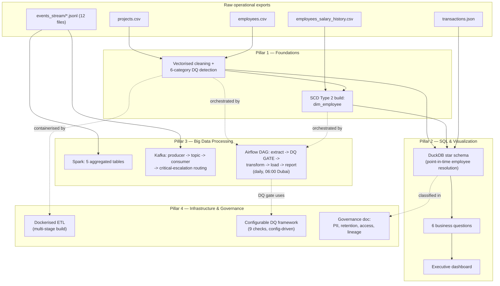

# Presight Analytics Platform: From Dirty Exports to a Governed, Scheduled Data Warehouse

*Author: Baiju Mohan*

> Master project story for interview walkthroughs. Each pillar has its own
> deeper write-up, same structure:
> [Foundations](interview_docs/01_foundations.md) ·
> [SQL & Visualization](interview_docs/02_sql_and_visualization.md) ·
> [Big Data Processing](interview_docs/03_big_data_processing.md) ·
> [Infrastructure & Governance](interview_docs/04_infrastructure_and_governance.md)
>
> To actually run the code: [HOW_TO_RUN.md](HOW_TO_RUN.md).

---

## 1. Executive Summary

Presight runs a project management platform for enterprise and government clients. The data behind it — project records, HR data, transactions, a platform event stream — existed only as raw exports: dirty, historyless, processed by hand when it was processed at all.

I built the data engineering layer that turns that into something the business can rely on: a cleaned foundation (Pandas), a queryable star-schema warehouse with real historical employee tracking (DuckDB + SCD Type 2), a big-data layer for the 100K-event stream (PySpark + Kafka), a scheduled and quality-gated pipeline (Airflow), and the infrastructure/governance work that makes it deployable and audit-ready (Docker, a governance doc, a DQ framework).

Every piece was run against real infrastructure and real data — and four genuine bugs were found and fixed specifically because I ran things end to end, not because the code looked correct on paper.

**At a glance:**

| Metric | Result |
|---|---|
| Full transactions ETL (50,000 rows) | **0.84s** (target: <30s) |
| Spark event processing (99,996 events, 12 files) | **114.7s**, ~872 events/sec |
| Kafka end-to-end (8,333 messages) | All consumed, 14 critical escalations correctly routed |
| Airflow DAG | Runs fully green; DQ gate proven to actually block on failure |
| Dockerised ETL container | **11.1s** wall-clock (target: <30s) |
| SCD2 dimension integrity | 0 duplicate-current rows, 0 overlapping periods, across 2,232 versions |
| Data quality checks (framework) | 9 checks × 3 datasets, real mixed results (6/9, 3/9, 6/9) |

## 2. Business Problem

Three teams, one root problem: no trustworthy, queryable, historically-aware data.

Finance and Operations needed recurring questions answered with no way to query directly — every answer meant manually reconciling CSVs. HR and Finance needed historical answers ("what was this person earning when they approved this spend"), which a current-state-only export can't give. The event stream (100K+ events) had outgrown ad hoc analysis — nobody could say which projects escalate most or when usage peaks.

Underneath all three: the pipeline only ran manually, with no schedule, no quality gate, and no governance doc — nothing Compliance could sign off on or Ops could trust unattended.

## 3. Project Scope

**In scope:** the full pipeline from raw export to governed, scheduled warehouse — cleaning and DQ detection, dimensional modeling with real SCD2, six business questions plus a measured query-optimisation exercise, an executive dashboard, Spark batch processing, Kafka ingestion, Airflow orchestration with a quality gate, containerisation, and governance documentation.

**Out of scope:** a multi-node Spark cluster or production Kafka deployment (scoped to prove pipeline logic, not cluster ops); a live Power BI connection (a data-accurate PDF mockup instead); cloud deployment (the env-var configuration makes that step straightforward later); final legal sign-off on retention periods (defensible defaults, flagged for review).

**Scale:** 500 projects, 1,000 employees, ~1,800 salary-history records, 50,000 transactions, 100,000 platform events across 12 files — large enough that vectorisation, indexing, and partitioning decisions have measurable consequences.

## 4. Technology Stack

| Technology | Role in the Project | Why It Was Chosen |
|---|---|---|
| Python + Pandas + NumPy | Cleaning, DQ detection, SCD2 build, transaction enrichment | Squarely vectorised-pandas territory at these row counts — a distributed engine here would be over-engineering |
| DuckDB | Warehouse — star schema, business questions, optimisation benchmarking | Embedded, vectorised, native `EXPLAIN ANALYZE` — zero server to stand up |
| Apache Spark (PySpark) | Distributed processing of the 100K-event stream into 5 tables | Where volume actually crosses into needing a distributed engine |
| Apache Kafka | Real-time ingestion simulation, severity-based routing | Standard decoupled pattern, foundation for batch-to-real-time |
| Apache Airflow 2.7 | Daily orchestration, retries, a hard DQ gate, XCom reporting | Built for scheduled, observable, dependency-ordered execution |
| Docker (multi-stage build) | Containerises the ETL into a portable artifact | Splits the heavy dependency install from the runtime image |
| Java 17 + Hadoop native libs | JVM runtime Spark depends on, Windows I/O support | Not optional — Spark doesn't run without it |

## 5. High-Level Architecture & Data Flow

The decision that ties everything together: treating `dim_employee` as real SCD Type 2 from the start. It's what makes the warehouse's point-in-time joins correct, what the compensation-history question depends on, and what the Airflow DQ gate re-validates on every run.

## 6. My Responsibilities & Contributions

Designed and built every layer end to end — the profiling that found the real data issues, the dimensional model, the SQL, the distributed processing, the streaming simulation, the orchestration, the containerisation, the governance doc. Verified every piece against real infrastructure, which is how the bugs below actually surfaced.

## 7. Key Engineering Decisions

**SCD Type 2 as the foundation, not an afterthought.** Once `dim_employee` versions salary/role/level, `fact_transactions` can resolve "who approved this, and what was true about them then" via a point-in-time `BETWEEN` match instead of a naive current-state lookup. Everything needing historical accuracy depends on this.

**Vectorisation as a hard rule.** Every DQ check and derived column is a whole-column operation — boolean masks, `np.select`, window functions instead of self-joins. Matters for readability at 1,000 rows; non-negotiable at 50,000+ for it to run in seconds, not minutes.

**Environment-variable configuration, built once, reused twice.** `DATA_DIR`/`OUTPUT_DIR` read from the environment solved the Airflow container's different filesystem layout in Pillar 3 — then solved the same problem for free in Pillar 4's Docker container.

**Reported honest results over convenient ones.** The query-optimisation exercise found no measurable DuckDB speedup, and I said so with the evidence. The zero-row business questions were verified against raw distributions, not assumed to be bugs. The DQ framework ran against real uncleaned data so its results would be genuine. When the real result wasn't the impressive one, I reported the real result.

## 8. Challenges & How I Solved Them

Four bugs, none visible from reading the code — all found by actually running the pipeline against real data and infrastructure:

- **A `np.select` call that broke only inside the Airflow container** — older pandas/numpy handled a nullable-boolean array differently. Found by running the DAG in the real container. *(Pillar 3)*
- **Negative escalation resolution times, down to -7,708 hours** — a positional pairing assumption broke when escalations weren't perfectly alternating. Found by checking actual output, not by trusting a clean run. *(Pillar 3)*
- **A Kafka double-serialization bug ~5,700 messages into a live run** — invisible to a smoke test, only caught by a full producer/consumer cycle against a real broker. *(Pillar 3)*
- **An SCD2 edge case at the intersection of two fixes** — employees with both an unparseable hire date and no salary history hit a path with nothing to set `valid_from` to. *(Pillar 1)*

Also worth naming: rather than trust the DQ gate's `raise ValueError`, I forced an impossible threshold, watched the gate fail and downstream tasks never run, then reverted and confirmed a clean run. Writing a check and proving it works are different things.

**A "fixed" bug that wasn't fully fixed.** The escalation-log guard above stopped negative durations, but I later found it was discarding 62% of escalations as "unresolved" rather than correctly matching them — the positional pairing itself was still wrong, the guard just hid the symptom. Replaced it with real temporal matching (each resolution claims the earliest still-open raise before it): correctly-resolved escalations went from 748 to 1,098, still zero negative durations. *(Pillar 3)*

**Two DQ framework gaps found by comparing against another trainee's independent solution**, not by re-reading my own code: `employees.manager_id` had no referential-integrity check against `employees.employee_id` (a legitimate self-referential FK), and the consistency check never actually verified salary-against-level despite the task naming that exact example. Fixed both — the self-reference surfaced a real, previously invisible issue (5 employees with a `manager_id` that doesn't resolve). *(Pillar 4)*

## 9. Data Quality, Reliability, Security & Performance

**Data quality**: targeted fixes during cleaning (Pillar 1, six issue categories from full-column profiling) plus a reusable framework (Pillar 4, 9 checks) that the Airflow DQ gate calls as a hard stop, not a warning.

**Reliability**: parallel extraction, a gate that provably blocks bad data, `retries=2`, `max_active_runs=1`, and an XCom-driven report of exactly what happened each run.

**Security**: every PII column tagged with GDPR/UAE PDPL, access control on least privilege — including narrower Data Engineer access to salary history than the "engineers need broad access" instinct suggests.

**Performance**: 0.63s for the transactions ETL, 93.3s for Spark across 99,996 events, 16.8s for the full Docker lifecycle — all measured by actually running the thing.

## 10. Outcome & Business Value

Finance and Operations get six previously-manual questions answered reliably, backed by a warehouse that threads historical employee context through every transaction. The event stream produces five analytics tables on every run, with a proven real-time path ready for what's next. The pipeline moved from "someone runs it manually" to scheduled, gated, containerised — reviewable by Compliance, deployable by DevOps.

Two Jupyter notebooks ([warehouse_explorer.ipynb](02_sql_and_viz/warehouse_explorer.ipynb), [big_data_explorer.ipynb](03_big_data/big_data_explorer.ipynb)) give a live, editable query surface over the warehouse and the Spark/Kafka outputs — useful for demoing the result interactively, not just reading static output.

More than any single number: every claim here is something I watched happen against real data, not something I assumed would work because the code looked right.

---

## Known limitations (worth having ready if asked)

1. Q2/Q3 in Pillar 2 return zero rows on this dataset — the checks are real and would fire where the condition occurs.
2. The query-optimisation exercise shows no measurable speedup on DuckDB at 50K rows; documented why, and where it'd matter at production Postgres scale.
3. Retention periods in the governance doc are defensible defaults pending Legal sign-off, not verified legal citations.
4. `bridge_employee_project` only captures the guaranteed manager↔project edge in the source data; documented in `data_model.sql`.
