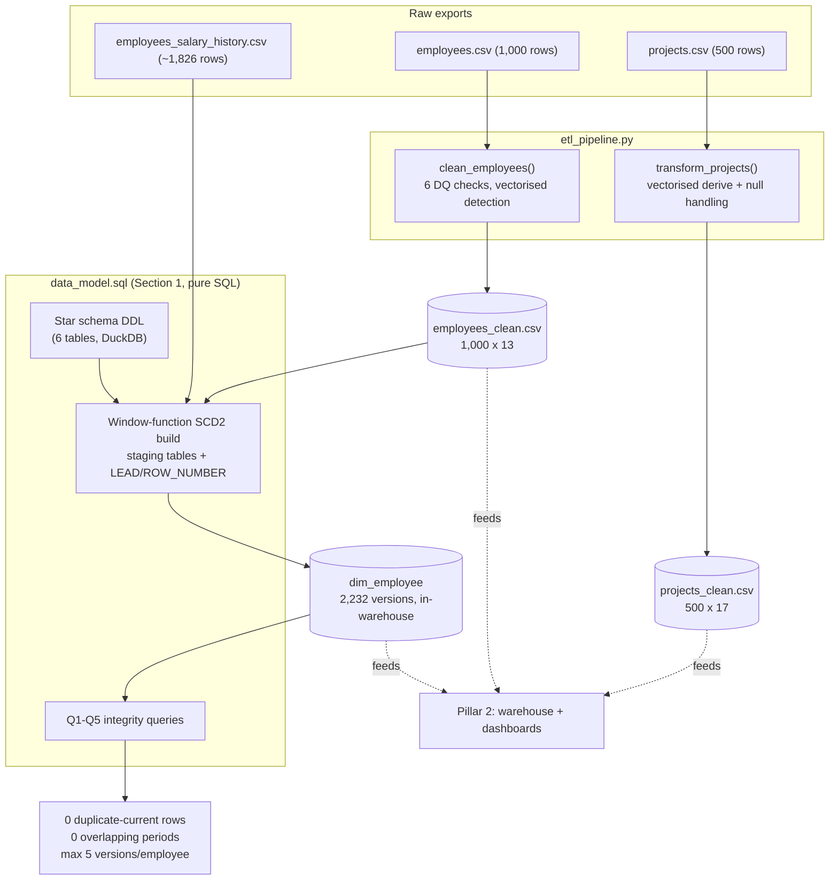

# Foundations: Cleaning, Modeling, and Versioning Presight's Core Data

## 1. Executive Summary

Presight runs a project management platform for enterprise and government clients. The project and employee exports had missing values, bad dates, and no history — if a salary changed six months ago, the export only ever shows today's value.

I built the foundation layer: a vectorised Pandas cleaning pipeline for projects/employees, and an SCD Type 2 model for `dim_employee` — built in SQL, straight from the cleaned CSV plus a separate change-history file — that reconstructs salary/role history. Output: two clean datasets and a 2,232-row SCD2 table that passes every integrity check, which everything downstream builds on.

## 2. Business Problem

The exports were built for running the business, not analysing it. Two problems:

**Data quality was quietly wrong.** 10 blank emails, 8 bad hire dates, 3 employees with salaries that didn't match their level. None of this shows up in the first 40 rows — I only found it by profiling full column distributions.

**No history existed.** Finance/HR needed questions like "what was this manager earning when they approved this spend" answered, but the source was a single current-state snapshot. Overwrite-in-place HR exports destroy exactly that history.

## 3. Project Scope

**In scope:** cleaning `projects.csv` (500 rows) and `employees.csv` (1,000 rows), designing the 6-table star schema, building `dim_employee` as SCD2 from the current export plus a ~1,826-row change history file.

**Out of scope:** loading transactions and the rest of the warehouse, business SQL, dashboards, Spark/Kafka/Airflow — later pillars.

**Constraint:** the history file covers ~60% of employees and only tracks salary/role/level — not department or manager moves. The SCD2 model is honest about that limit rather than implying more history than exists.

## 4. Technology Stack

| Technology | Role in the Project | Why It Was Chosen |
|---|---|---|
| Python | Core scripting for the pipeline | Best fit for data wrangling, mature ecosystem |
| Pandas | Cleaning + DQ detection for projects/employees | Vectorised ops are the right scale here — Spark comes later, at 100K+ rows |
| NumPy | `np.select`/`np.where` for derived columns | Conditional logic as one array op instead of per-row branching |
| DuckDB | Builds `dim_employee` (SCD2) in SQL, runs validation | Embedded, no server, reads CSV natively — window functions do the versioning |
| Python `logging` | Detection/fix reporting | Every issue and fix is logged — the log output is the audit trail |

## 5. High-Level Architecture & Data Flow

Cleaning is a straight line: load, detect, fix, write. The SCD2 build lives entirely in SQL — staging tables plus window functions (`ROW_NUMBER`, `LEAD`) merge two differently-shaped sources (a wide current-state table, a narrow change log) into one versioned dimension, directly inside the warehouse, then validates it immediately.

## 6. My Responsibilities & Contributions

Owned this layer end to end — profiled the raw data myself, wrote the cleaning logic, designed the star schema and the SCD2 model, and wrote the validation queries that prove it, not just eyeball it.

## 7. Key Engineering Decisions

**Null-fill before deriving.** Computing `budget_variance` before filling null `budget`/`actual_cost` leaves it `NaN` for those rows. I fill first, derive second, so every downstream aggregate is well-defined.

**Vectorised everywhere.** Every DQ check is a boolean mask, not a per-row loop. Matters less at 1,000 rows, matters a lot once the same pattern has to scale to 50,000 transactions two pillars later.

**Winsorised salary outliers instead of deleting them.** Three employees had salaries way outside their level's band. Deleting the row throws away an otherwise-valid record; capping to the level's 95th percentile (and flagging it) keeps the record usable.

**Documented what SCD2 can't track.** History only covers salary/role/level, not department or manager. Every other attribute carries forward from the current snapshot, and that's stated directly rather than implied away.

## 8. Challenges & How I Solved Them

**A real data conflict.** One employee (`EMP0084`) had a history-file salary that didn't match the current export. Resolution rule: current export wins, documented — not left to chance based on load order.

**Hire date + no history, together.** Fixing 8 garbage `hire_date` values (Task 1.3) meant some of those employees also had no salary history, so SCD2 had nothing to set `valid_from` to. Used a documented sentinel (`1900-01-01`) rather than leave it null and break the overlap-check query.

**A `np.select` bug that only showed up in a different environment.** Ran fine locally, broke inside the Airflow container (Pillar 3) because its older pandas/numpy handles nullable-boolean arrays differently. Fixed with an explicit `.to_numpy(dtype=bool)` cast.

## 9. Data Quality, Reliability, Security & Performance

All six DQ checks are backed by real full-column scans, not guesses — including a sixth guardrail (Active employee under an Inactive manager) that finds zero on this data and stays in anyway.

PII fields (`full_name`, `email`, salary) pass through but aren't logged in plaintext beyond the source data; access control lives in the governance layer (Pillar 4).

The full pipeline runs in a couple of seconds locally — the vectorised approach has real headroom at production scale.

## 10. Outcome & Business Value

Two clean datasets and an SCD2 dimension with zero integrity failures. Everything downstream — the warehouse, Q6's compensation trend, the Airflow DQ gate — builds on this directly, reusing the same cleaning logic rather than a second copy.

The value: Finance/HR can now ask time-aware questions the raw exports structurally couldn't answer, and every fix is logged and defensible.
