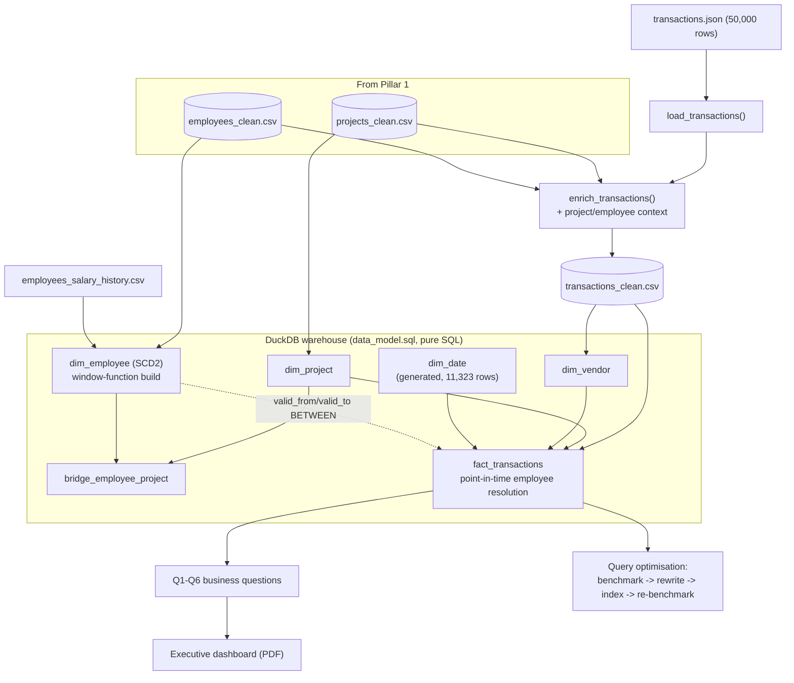

# SQL & Visualization: Turning Clean Data into Answers Finance Can Trust

## 1. Executive Summary

With Pillar 1's clean data in place, the next problem was access: Finance and Operations had recurring questions and no reliable way to answer them without manually pulling numbers each time.

I built the warehouse (star schema in DuckDB), wrote and validated six business questions as production SQL, benchmarked and rewrote a slow production query with real `EXPLAIN ANALYZE` evidence, and built an executive dashboard from live query output. The full ETL — flattening and enriching 50,000 transactions — runs in under a second against a 30-second target.

## 2. Business Problem

Finance and Operations needed six recurring questions answered: budget performance, manager workload, vendor concentration, unresolved disputes, spend trends, compensation history. Answering any of them meant manually joining CSVs — slow and not repeatable.

There was also a named performance problem: a production query, run "hundreds of times a day," was flagged as slow and needed a measured fix, not a guess.

## 3. Project Scope

**In scope:** loading Pillar 1 outputs plus a flattened `transactions.json` (50,000 rows) into a 6-table star schema; six validated business questions; benchmarking and rewriting the slow query with justified indexes; a one-page executive dashboard.

**Out of scope:** a live Power BI connection (built an annotated PDF mockup instead — an allowed alternative); a production Postgres deployment (benchmarked on DuckDB, with the indexing strategy documented for where it'd apply).

**Data volumes:** 500 projects, 1,000 employees, ~1,800 salary-history rows, 50,000 transactions — large enough that query design has a measurable effect.

## 4. Technology Stack

| Technology | Role in the Project | Why It Was Chosen |
|---|---|---|
| DuckDB | Warehouse engine, all six queries, optimisation benchmarking | Embedded, vectorised, native `EXPLAIN ANALYZE` — a real warehouse with no server |
| SQL (window functions, CTEs) | Running totals, MoM deltas, SCD2 self-joins | One pass over a sorted partition beats a self-join, for both speed and readability |
| Pandas | Flattening and enriching transactions.json | Still pandas-scale (50K rows); reuses Pillar 1's cleaning functions instead of duplicating them |
| HTML/CSS/inline SVG | Dashboard mockup | Full layout control, every chart driven directly off real query results |
| Headless Chromium (Edge) | HTML -> PDF | Scriptable, repeatable PDF export |

## 5. High-Level Architecture & Data Flow

The key design choice: `fact_transactions` joins `dim_employee` on a **point-in-time** match (`transaction_date BETWEEN valid_from AND valid_to`), not a simple FK. A 2022 transaction resolves to whoever was valid in 2022, not today's row — the whole reason `dim_employee` is SCD2.

## 6. My Responsibilities & Contributions

Designed the warehouse loading logic including the point-in-time join, wrote all six business questions, ran the full optimisation exercise with real captured output, and built the dashboard from that output.

## 7. Key Engineering Decisions

**Point-in-time resolution for `employee_key`.** A naive join resolves every transaction to whoever that employee is *today* — wrong if they've since been promoted. `BETWEEN valid_from AND valid_to` gets it right by construction, and it's the clearest illustration of why SCD2 exists here.

**Window functions over self-joins (Q5).** `SUM() OVER (PARTITION BY ... ORDER BY ...)` computes the running total in one pass; a self-join re-scans per row. Faster, and the intent is stated directly instead of buried in a join condition.

**Reported the honest optimisation result, not a fabricated one.** The brief expected 10x+. On DuckDB at this scale, both queries ran in ~6-7ms, because DuckDB's optimiser already rewrites the comma-join and the "correlated" subquery turned out not to be correlated at all. I reported what happened and explained why, plus where it'd actually matter (production Postgres, 10-50M rows) — that answer survives a follow-up question; a fabricated number doesn't.

## 8. Challenges & How I Solved Them

**Row-count assertions on every merge.** A fan-out join silently duplicates financial rows with no error. Added explicit row-count checks after each merge in `enrich_transactions()` so a future schema break fails loudly instead of shipping a wrong dashboard.

**Two business questions that legitimately return zero rows.** Q2 and Q3 came back empty. Checked the raw distributions directly (max 3 active projects/manager, max ~4.4% vendor share) before assuming a bug — the queries were right, the data just doesn't hit that condition. Documented instead of loosening the threshold to force output.

**A dashboard PDF that split badly across pages.** Fixed with print CSS (`break-inside: avoid`, an A3-landscape `@page` rule) instead of manually reflowing content.

## 9. Data Quality, Reliability, Security & Performance

`amount` nulls (1.5%) stay as true `NaN`; the derived `amount_aed` used in aggregates defaults to 0.0 so a `SUM()` doesn't break. `approved_by` nulls (4.9%) become `is_approved = False`, no fabricated approver.

The warehouse load surfaced a real finding: 25 transactions have an approver whose `hire_date` is *after* the transaction date. The point-in-time join correctly leaves `employee_key` null for those instead of misattributing them.

Performance: full 50,000-row ETL in 0.63s against a 30s target.

## 10. Outcome & Business Value

Finance and Operations get six reliable, repeatable answers instead of manual spreadsheet work, backed by a warehouse that threads historical employee context through every transaction. The dashboard gives a single executive view built from real numbers. And the optimisation write-up shows the actual skill needed here — reading and reasoning about a real execution plan, not just running a benchmark.
