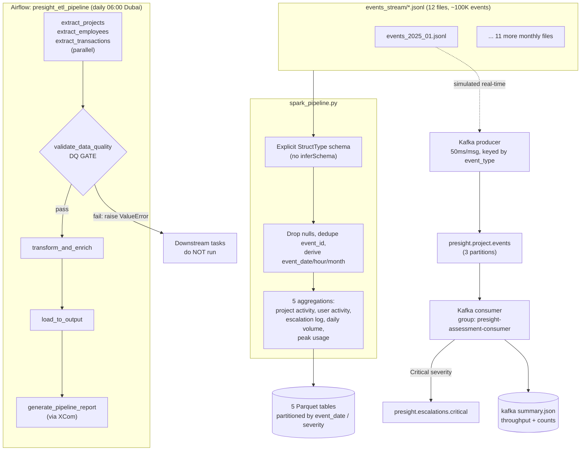

# Big Data Processing: Spark, Kafka, and a Quality-Gated Airflow Pipeline

## 1. Executive Summary

Presight's platform emits a continuous event stream — logins, escalations, uploads. At 100,000 events across 12 monthly files, the pandas approach from earlier pillars stopped being the right tool.

I built a PySpark pipeline turning the event stream into five analytics tables, a Kafka producer/consumer simulating real-time ingestion with severity routing, and an Airflow DAG orchestrating the whole pipeline daily with a data-quality gate I proved actually blocks on failure. Every piece ran against real infrastructure — a live Kafka broker, an actual Airflow container — which is how I caught four bugs a local-only review would have missed.

## 2. Business Problem

Two problems. Immediate: nobody could query the event stream — which projects escalate most, when usage peaks, how long escalations stay open. Forward-looking: the pandas pipeline had no path to real-time, ran manually, with no schedule and no protection against loading bad data.

Data engineering needed the batch analytics; the platform needed a proven streaming pattern; the team needed the pipeline to stop being something someone had to remember to run.

## 3. Project Scope

**In scope:** Spark batch processing of all 12 files into five tables; a Kafka producer/consumer with critical-escalation forwarding; an Airflow DAG (extract → DQ gate → transform → load → report) on a daily schedule.

**Out of scope:** a multi-node Spark cluster (100K rows doesn't need it — the point was proving pipeline logic); Spark Structured Streaming (this is a batch producer/consumer simulation); a production Kafka deployment (single local broker).

**Constraint:** local Windows development — PySpark's file-globbing needs Hadoop's native libraries, which don't come with `pip install pyspark`.

## 4. Technology Stack

| Technology | Role in the Project | Why It Was Chosen |
|---|---|---|
| PySpark | Distributed processing into 5 aggregated Parquet tables | Where vectorised pandas stops being the right fit |
| Apache Kafka | Real-time ingestion simulation, topic routing | Standard decoupling pattern, the natural next step past daily batch |
| Apache Airflow 2.7 | Daily orchestration, retries, DQ gate, XCom reporting | Built for dependency-ordered scheduled tasks with visible failures |
| Java 17 (Temurin) | JVM runtime Spark depends on | Not optional — Spark is JVM-based regardless of the Python wrapper |
| Docker Compose | Local Kafka, Zookeeper, Airflow, Postgres | Reproducible infra without hand-installing four services |

## 5. High-Level Architecture & Data Flow

## 6. My Responsibilities & Contributions

Built all three components — Spark pipeline, Kafka producer/consumer, and the Airflow DAG including the DQ gate and the deployment mechanism that runs Pillar 1/2's code inside the Airflow container. Also solved the local Windows/Spark environment setup.

## 7. Key Engineering Decisions

**Explicit schema over `inferSchema`.** Inference means an extra full pass just to guess types, and the nested `payload` field can't be inferred reliably anyway. Defined the `StructType` up front instead.

**Partitioning tied to actual query patterns.** `daily_event_volume` partitioned by `event_date` (date-range queries); `escalation_log` by `severity` ("show me the Critical ones"). Partitioning has overhead, so each choice matches how the table actually gets queried.

**Environment-variable-driven `DATA_DIR`/`OUTPUT_DIR`.** The same pipeline code runs on my dev machine and inside the Airflow container, which has a different filesystem layout. Path resolution reads from env vars instead of maintaining two versions — and this same mechanism ended up solving Pillar 4's containerisation requirement for free.

**DAG dependencies deployed as sibling modules, not a package.** Airflow puts `dags/` on `sys.path`, so copying `etl_pipeline.py`/`etl_full.py`/`dq_framework.py` alongside the DAG lets it `import etl_pipeline` directly — no packaging step.

## 8. Challenges & How I Solved Them

**PySpark couldn't read files at all on Windows.** First run failed with `UnsatisfiedLinkError` — Spark's file listing needs Hadoop's Windows-native I/O layer, which `pip install pyspark` doesn't ship. Installed Java 17, fetched the matching Hadoop 3.3.5 native binaries, wired `HADOOP_HOME`.

**A silent bug in escalation pairing.** My first version paired the Nth "raised" with the Nth "resolved" event per project — correct only if they perfectly alternate, which they don't when a project has multiple escalations open at once. Result: resolution times as negative as -7,708 hours. Found by checking the actual output, not by trusting a clean run. Fixed with a validity guard: any pair where `resolved_at <= raised_at` is reported unresolved instead.

**A Kafka bug that only showed up ~5,700 messages in.** The escalation-forwarding branch pre-encoded key/value to bytes, then handed them to a producer with its own serializer already configured — double encoding, threw `AttributeError` the first time a Critical escalation needed forwarding. A smoke test would never catch this; only a full run against a live broker did.

**Proved the DQ gate actually blocks.** Didn't just trust the `raise ValueError`. Set the threshold to an impossible value, watched the gate fail and downstream tasks never run, then reverted and confirmed a clean run.

## 9. Data Quality, Reliability, Security & Performance

`validate_data_quality` is a hard gate: reloads all three datasets, runs the Pillar 4 DQ framework, raises if completeness on a primary key drops below 80%. With `retries=2`/`max_active_runs=1`, a bad extract gets caught and retried instead of propagating.

Real numbers: Spark processed all 99,996 events in 93.3s (~1,072 events/sec). Kafka consumed all 8,333 messages at ~618 msg/sec, forwarding 14 Critical escalations correctly.

## 10. Outcome & Business Value

The event stream went from unqueryable to five analytics-ready tables, reproducible on any future file drop. Kafka proves out the real-time ingestion pattern for whatever comes after daily batch. And the pipeline stopped depending on someone remembering to run it — it's scheduled, retried, gated, and proven to actually block bad data rather than just claiming to.
