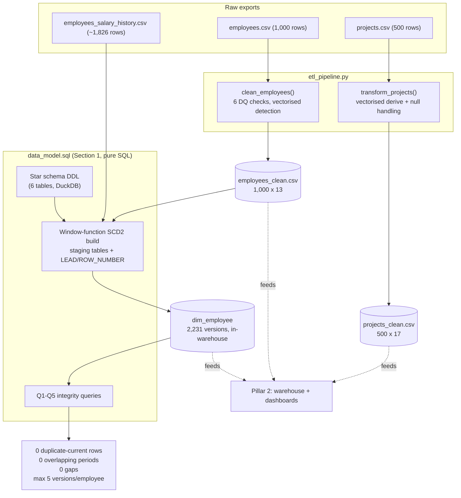

# Foundations: Cleaning, Modeling, and Versioning Presight's Core Data

## 1. Executive Summary

Presight is a project management platform for enterprise and government clients. The project and employee data it exports has missing values, bad dates, and no history — if a salary changed six months ago, the export only ever shows today's value.

This pillar builds the foundation layer: a Pandas pipeline that cleans the projects and employees data, and an SCD Type 2 model for `dim_employee` — built in SQL, from the cleaned employee data plus a separate salary/role change-history file — that reconstructs each employee's history. Output: two clean datasets and a 2,231-row table that passes every check run against it, which everything else in the project builds on.

## 2. Business Problem

The exports were built to run day-to-day operations, not to analyse the business. Two problems:

**The data quality was wrong in ways that aren't obvious.** 10 blank emails, 8 bad hire dates, 3 employees with a salary that doesn't match their level. None of this shows up if you only look at the first 40 rows — it was only found by checking every column across the full file.

**There was no history.** Finance and HR needed to answer questions like "what was this manager earning when they approved this spend," but the source data only shows the current state. The HR export overwrites old values in place, so that history doesn't exist anywhere.

## 3. Project Scope

**In scope:** cleaning `projects.csv` (500 rows) and `employees.csv` (1,000 rows); designing a 6-table star schema; building `dim_employee` with history, using the current employee data plus a ~1,826-row change-history file.

**Out of scope:** loading transactions and the rest of the warehouse, the business SQL questions, dashboards, Spark/Kafka/Airflow — all covered in later pillars.

**A real limit worth stating plainly:** the history file only covers about 60% of employees, and only tracks salary/role/level — not department or manager changes. This is stated directly rather than implying the history is more complete than it is.

## 4. Technology Stack

| Technology | Role in the Project | Why It Was Chosen |
|---|---|---|
| Python | Core scripting for the pipeline | Best fit for data wrangling, mature ecosystem |
| Pandas | Cleaning + DQ detection for projects/employees | Vectorised ops are the right scale here — Spark comes later, at 100K+ rows |
| NumPy | `np.select`/`np.where` for derived columns | Conditional logic as one array op instead of per-row branching |
| DuckDB | Builds `dim_employee` (SCD2) in SQL, runs validation | Embedded, no server, reads CSV natively — window functions do the versioning |
| Python `logging` | Detection/fix reporting | Every issue and fix is logged — the log output is the audit trail |

## 5. High-Level Architecture & Data Flow

Cleaning is a straight line: load, detect, fix, write. The SCD2 build lives entirely in SQL — staging tables plus window functions (`ROW_NUMBER`, `LEAD`) merge two differently-shaped sources (a wide current-state table, a narrow change log) into one versioned dimension, directly inside the warehouse, then validates it immediately.

## 6. Key Engineering Decisions

**Null-fill before deriving.** Computing `budget_variance` before filling null `budget`/`actual_cost` leaves it `NaN` for those rows. I fill first, derive second, so every downstream aggregate is well-defined.

**Vectorised everywhere.** Every DQ check is a boolean mask, not a per-row loop. Matters less at 1,000 rows, matters a lot once the same pattern has to scale to 50,000 transactions two pillars later.

**Winsorised salary outliers instead of deleting them.** Three employees had salaries way outside their level's band. Deleting the row throws away an otherwise-valid record; capping to the level's 95th percentile (and flagging it) keeps the record usable.

**Documented what SCD2 can't track.** History only covers salary/role/level, not department or manager. Every other attribute carries forward from the current snapshot, and that's stated directly rather than implied away.

## 7. Challenges & Fixes

**A real conflict between two data sources.** Two employees (`EMP0356`, `EMP0900`) had a salary in the history file that didn't match the current employee export. Rule: the current export wins, and this is written down as a decision, not left to whichever file happened to load first.

**A same-day duplicate that broke the SCD2 interval math.** One employee (`EMP0084`) had two salary changes dated the exact same day. `valid_to` is computed as the next version's `valid_from` minus one day — with two versions sharing one `valid_from`, that produced a version with `valid_to` *before* `valid_from`. The overlap-check validation query couldn't catch it (it assumes `valid_to >= valid_from`); only the gap-check query could. This had actually been misdiagnosed once already, as the unrelated conflict above — re-tracing it while capturing real validation output for a presentation found the actual cause. Fixed by collapsing same-day history rows to their final state before building versions.

**Missing hire date and missing history, together.** Fixing 8 broken `hire_date` values in Task 1.3 meant some of those same employees also had no salary history — so there was nothing to set their starting record date from. Used a fixed placeholder date (`1900-01-01`) instead of leaving it blank, since a blank value would have broken the check that looks for overlapping date ranges.

**A calculation that only broke in a different environment.** Ran fine locally, but failed inside the Airflow container (Pillar 3) because that container has an older version of pandas/numpy that handles a certain data type differently. Fixed by converting the value to a plain type before using it.

## 8. Data Quality, Reliability, Security & Performance

All six DQ checks are backed by real full-column scans, not guesses — including a sixth guardrail (Active employee under an Inactive manager) that finds zero on this data and stays in anyway.

PII fields (`full_name`, `email`, salary) pass through but aren't logged in plaintext beyond the source data; access control lives in the governance layer (Pillar 4).

The full pipeline runs in a couple of seconds locally — the vectorised approach has real headroom at production scale.

## 9. Outcome & Business Value

Two clean datasets and an SCD2 dimension with zero integrity failures. Everything downstream — the warehouse, Q6's compensation trend, the Airflow DQ gate — builds on this directly, reusing the same cleaning logic rather than a second copy.

The value: Finance/HR can now ask time-aware questions the raw exports structurally couldn't answer, and every fix is logged and defensible.
