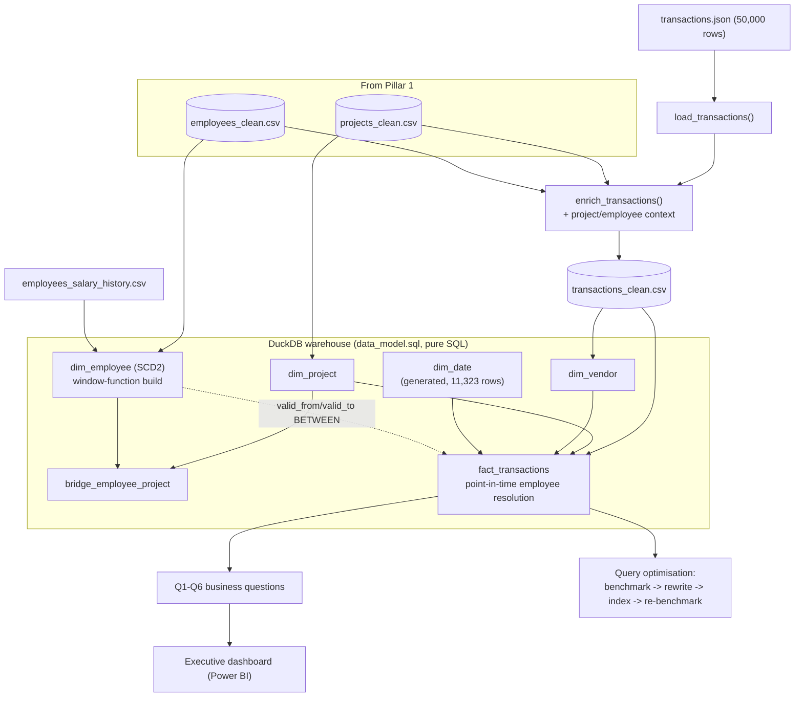

# SQL & Visualization: Turning Clean Data into Answers Finance Can Trust

## 1. Executive Summary

With Pillar 1's clean data ready, the next problem was access: Finance and Operations had recurring questions and no reliable way to answer them without manually pulling numbers each time.

This pillar builds the warehouse (a star schema in DuckDB), writes and checks six business questions as SQL, benchmarks and rewrites a slow query with real timing evidence, and builds an executive dashboard from the live data. The full ETL — loading and enriching 50,000 transactions — runs in under a second against a 30-second target.

## 2. Business Problem

Finance and Operations had six recurring questions: budget performance, manager workload, vendor concentration, unresolved disputes, spend trends, and compensation history. Answering any of them meant manually joining CSV files together — slow, and had to be redone from scratch each time.

There was also a specific performance problem: a query that runs "hundreds of times a day" in production was flagged as slow and needed an actual measured fix, not a guess at what might help.

## 3. Project Scope

**In scope:** loading Pillar 1's output plus a flattened `transactions.json` (50,000 rows) into a 6-table warehouse; six checked business questions; benchmarking and rewriting the slow query with reasoned indexes; a one-page executive dashboard.

**Out of scope:** a production Postgres deployment — benchmarked on DuckDB instead, with the indexing strategy written down for where it would apply on Postgres.

**Data volumes:** 500 projects, 1,000 employees, about 1,800 salary-history rows, 50,000 transactions.

## 4. Technology Stack

| Technology | Role in the Project | Why It Was Chosen |
|---|---|---|
| DuckDB | Warehouse engine, all six queries, optimisation benchmarking | Embedded, vectorised, native `EXPLAIN ANALYZE` — a real warehouse with no server |
| SQL (window functions, CTEs) | Running totals, MoM deltas, SCD2 self-joins | One pass over a sorted partition beats a self-join, for both speed and readability |
| Pandas | Flattening and enriching transactions.json | Still pandas-scale (50K rows); reuses Pillar 1's cleaning functions instead of duplicating them |
| Power BI Desktop | Executive dashboard | Connects directly to `projects_clean.csv`/`transactions_clean.csv` — the actual required tool, not a mockup |

## 5. High-Level Architecture & Data Flow

The key design choice: `fact_transactions` joins `dim_employee` on a **point-in-time** match (`transaction_date BETWEEN valid_from AND valid_to`), not a simple FK. A 2022 transaction resolves to whoever was valid in 2022, not today's row — the whole reason `dim_employee` is SCD2.

## 6. Key Engineering Decisions

**Point-in-time resolution for `employee_key`.** A naive join resolves every transaction to whoever that employee is *today* — wrong if they've since been promoted. `BETWEEN valid_from AND valid_to` gets it right by construction, and it's the clearest illustration of why SCD2 exists here.

**Window functions over self-joins (Q5).** `SUM() OVER (PARTITION BY ... ORDER BY ...)` computes the running total in one pass; a self-join re-scans per row. Faster, and the intent is stated directly instead of buried in a join condition.

**Reported the honest optimisation result, not a fabricated one.** The brief expected 10x+. On DuckDB at this scale, both queries ran in ~6-7ms, because DuckDB's optimiser already rewrites the comma-join and the "correlated" subquery turned out not to be correlated at all. I reported what happened and explained why, plus where it'd actually matter (production Postgres, 10-50M rows) — that answer survives a follow-up question; a fabricated number doesn't.

## 7. Challenges & Fixes

**Checking that joins don't quietly duplicate rows.** If a join accidentally matches more than one row on the other side, it silently duplicates financial rows with no error message. Added a row-count check after each join in `enrich_transactions()`, so if this ever happens the pipeline fails loudly instead of quietly shipping a wrong dashboard.

**Two business questions that genuinely return no rows.** Q2 and Q3 came back empty. Before assuming this was a bug, checked the raw numbers directly — the highest active-project count for any one manager is 3, and the highest vendor spend share is about 4.4%, both below what the queries are checking for. The queries are correct; the condition just doesn't occur in this data. This is written down rather than loosening the thresholds just to force some output.

**A Power BI relationship setup that would have quietly broken filtering.** The plan was one Year slicer that filters both the project-level charts and the transaction-level trend line. Doing that by connecting `projects_clean` directly to the Date table would create a loop, since `projects_clean` and `transactions_clean` are already connected to each other through `project_id`, and both connect to the Date table too. Power BI doesn't error on this — it silently turns off one of the three relationships instead, which would have broken filtering without any warning. Instead of guessing which relationship it would disable, two separate slicers were kept: a `Project Year` column on `projects_clean` filters both the project charts and the transactions (through the existing `project_id` link), while the Date table's own `Year` only drives the trend line.

## 8. Data Quality, Reliability, Security & Performance

`amount` nulls (1.5%) stay as true `NaN`; the derived `amount_aed` used in aggregates defaults to 0.0 so a `SUM()` doesn't break. `approved_by` nulls (4.9%) become `is_approved = False`, no fabricated approver.

The warehouse load surfaced a real finding: 25 transactions have an approver whose `hire_date` is *after* the transaction date. The point-in-time join correctly leaves `employee_key` null for those instead of misattributing them.

Performance: full 50,000-row ETL in 0.63s against a 30s target.

## 9. Outcome & Business Value

Finance and Operations get six reliable, repeatable answers instead of manual spreadsheet work, backed by a warehouse that threads historical employee context through every transaction. The dashboard gives a single executive view built from real numbers. And the optimisation write-up shows the actual skill needed here — reading and reasoning about a real execution plan, not just running a benchmark.
