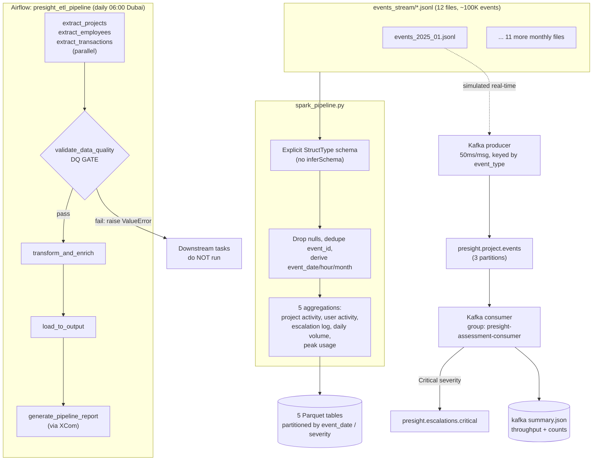

# Big Data Processing: Spark, Kafka, and a Quality-Gated Airflow Pipeline

## 1. Executive Summary

Presight's platform produces a continuous stream of events — logins, escalations, file uploads. At 100,000 events across 12 monthly files, the Pandas approach used in the earlier pillars was no longer the right tool for this volume.

This pillar builds a PySpark pipeline that turns the event stream into five summary tables, a Kafka producer/consumer that simulates real-time ingestion with severity-based routing, and an Airflow pipeline that runs the whole thing daily with a data-quality gate — tested directly to confirm it actually blocks bad data instead of just assuming the code works. Every part ran against real infrastructure — a live Kafka broker, an actual Airflow container — which is how four bugs described below were actually found.

## 2. Business Problem

Two problems. The immediate one: nobody could query the event stream to answer questions like which projects have the most escalations, when usage peaks, or how long escalations stay open. The longer-term one: the existing Pandas pipeline had no path to real-time processing, ran only when someone remembered to run it manually, and had no schedule or protection against loading bad data.

## 3. Project Scope

**In scope:** Spark batch processing of all 12 files into five summary tables; a Kafka producer/consumer that forwards critical escalations to their own topic; an Airflow pipeline (extract → data-quality check → clean → load → report) on a daily schedule.

**Out of scope:** a multi-node Spark cluster — 100,000 rows doesn't need one, and the goal was to prove the pipeline logic works, not to run it at production scale; Spark Structured Streaming — this is a batch producer/consumer simulation, not true streaming; a production Kafka deployment — a single local broker is used instead.

**A practical constraint:** developed on Windows, where PySpark needs Hadoop's native libraries to read files — these don't come with `pip install pyspark` and had to be installed separately.

## 4. Technology Stack

| Technology | Role in the Project | Why It Was Chosen |
|---|---|---|
| PySpark | Distributed processing into 5 aggregated Parquet tables | Where vectorised pandas stops being the right fit |
| Apache Kafka | Real-time ingestion simulation, topic routing | Standard decoupling pattern, the natural next step past daily batch |
| Apache Airflow 2.7 | Daily orchestration, retries, DQ gate, XCom reporting | Built for dependency-ordered scheduled tasks with visible failures |
| Java 17 (Temurin) | JVM runtime Spark depends on | Not optional — Spark is JVM-based regardless of the Python wrapper |
| Docker Compose | Local Kafka, Zookeeper, Airflow, Postgres | Reproducible infra without hand-installing four services |

## 5. High-Level Architecture & Data Flow

## 6. Key Engineering Decisions

**Explicit schema over `inferSchema`.** Inference means an extra full pass just to guess types, and the nested `payload` field can't be inferred reliably anyway. Defined the `StructType` up front instead.

**Partitioning tied to actual query patterns.** `daily_event_volume` partitioned by `event_date` (date-range queries); `escalation_log` by `severity` ("show me the Critical ones"). Partitioning has overhead, so each choice matches how the table actually gets queried.

**Environment-variable-driven `DATA_DIR`/`OUTPUT_DIR`.** The same pipeline code runs on my dev machine and inside the Airflow container, which has a different filesystem layout. Path resolution reads from env vars instead of maintaining two versions — and this same mechanism ended up solving Pillar 4's containerisation requirement for free.

**DAG dependencies deployed as sibling modules, not a package.** Airflow puts `dags/` on `sys.path`, so copying `etl_pipeline.py`/`etl_full.py`/`dq_framework.py` alongside the DAG lets it `import etl_pipeline` directly — no packaging step.

## 7. Challenges & Fixes

**PySpark couldn't read any files on Windows at first.** The first run failed with `UnsatisfiedLinkError` — Spark needs Hadoop's Windows-native file-handling library to list files, and `pip install pyspark` doesn't include it. Fixed by installing Java 17 and the matching Hadoop 3.3.5 native binaries, and pointing `HADOOP_HOME` at them.

**A silent bug in matching escalations.** The first version matched the 1st "raised" event with the 1st "resolved" event, the 2nd with the 2nd, and so on, per project. This only works if they alternate perfectly, which isn't true when a project has more than one escalation open at the same time. Result: resolution times as long as -7,708 hours, which is impossible. Found by checking the actual output, not by assuming a clean-looking run meant it worked. First fix: skip any pair where the resolved time is before the raised time.

**A Kafka bug that only appeared partway through a run.** Around message 5,700 of 8,333, forwarding a Critical escalation started throwing an error. The code was encoding the message to bytes manually, then also handing it to a producer that already had its own encoding configured — double encoding. A short test wouldn't have caught this; only a full run against a live broker did.

**Testing that the data-quality check actually blocks bad data.** Rather than just trust that the check would work as written, it was tested directly: set the threshold to an impossible value, confirmed the pipeline stopped and nothing downstream ran, then set it back and confirmed a normal run still passes.

## 8. Data Quality, Reliability, Security & Performance

`validate_data_quality` is a hard gate: reloads all three datasets, runs the Pillar 4 DQ framework, raises if completeness on a primary key drops below 80%. With `retries=2`/`max_active_runs=1`, a bad extract gets caught and retried instead of propagating.

Real numbers: Spark processed all 99,996 events in 93.3s (~1,072 events/sec). Kafka consumed all 8,333 messages at ~618 msg/sec, forwarding 14 Critical escalations correctly.

## 9. Outcome & Business Value

The event stream went from unqueryable to five analytics-ready tables, reproducible on any future file drop. Kafka proves out the real-time ingestion pattern for whatever comes after daily batch. And the pipeline stopped depending on someone remembering to run it — it's scheduled, retried, gated, and proven to actually block bad data rather than just claiming to.
