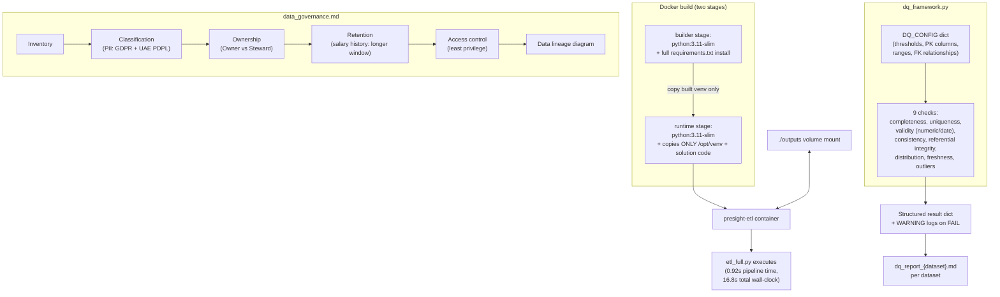

# Infrastructure & Governance: Making the Pipeline Deployable, Compliant, and Self-Checking

## 1. Executive Summary

A pipeline that only runs on the machine it was built on isn't something that can be handed to another team to operate. And a pipeline that touches salary history and government-client data, with no documentation on who can access it, isn't something Compliance can sign off on. This pillar covers both: a Docker build for the Pillar 2 ETL, a governance document covering all four datasets, and a configurable data-quality framework that can be extended by editing a settings file instead of changing code.

The container runs the full 50,000-transaction ETL in under 17 seconds against a 30-second target. The data-quality framework runs 9 checks against the real data, with a genuine mix of passes and failures — it was run against the raw, uncleaned datasets rather than tuned to look clean.

## 2. Business Problem

Three gaps. The pipeline could only be run manually on one machine — nothing a scheduler or another team could pick up directly. There was no documentation on who can access the salary history and government-client project data, or under what regulation. And the data-quality checks that existed were one-off logic inside the pipeline code, so every new rule meant a code change and a redeploy.

## 3. Project Scope

**In scope:** a Docker build (with `.dockerignore`) for the Pillar 2 ETL; a governance document covering all four datasets; a configurable data-quality framework with at least 6 checks (9 were built).

**Out of scope:** actually deploying to the cloud — the environment-variable-based configuration makes that a straightforward next step rather than a rewrite; a secrets manager — nothing in this pipeline currently needs one; final legal sign-off on retention periods — documented as reasonable defaults and flagged for Legal to confirm, not presented as settled.

## 4. Technology Stack

| Technology | Role in the Project | Why It Was Chosen |
|---|---|---|
| Docker | Containerises the ETL into a portable artifact | Standard "runs the same way everywhere" — eliminates "works on my machine" |
| Multi-stage build | Separates the dependency-install stage from the runtime image | `requirements.txt` pulls in a large tree (incl. Airflow's); a single stage would ship all of pip's build cache in the final image |
| Docker Compose override | Adds a bonus `etl` service + env vars without editing the fixed `docker-compose.yml` | Keeps additions separate from provided infra; Compose merges overrides automatically |
| Python (config-driven) | The DQ check engine (`dq_framework.py`) | A plain dict-driven design gave real configurability without a heavier framework |

## 5. High-Level Architecture & Data Flow

## 6. Key Engineering Decisions

**Multi-stage build to contain a literal instruction's cost.** The task specified installing `requirements.txt` as-is, which pulls in Airflow's full dependency tree — far more than `etl_full.py` needs, and slow to resolve. Rather than quietly trim the file, I kept it as instructed and used the multi-stage split to keep that cost out of the runtime image.

**Config-driven DQ rules.** Every check reads thresholds, PK columns, and FK relationships out of `DQ_CONFIG` — none hardcode a column name. A new rule means a config entry, not a code change.

**Narrower Data Engineer access on salary history.** The instinct is "engineers get broad access." I gave Data Engineers Read, not Read+Write, on `employees_salary_history` — the pipeline only needs to read it for the SCD2 build; corrections belong in HR's own tooling. The one place I went narrower than the obvious call.

**Reused the Pillar 3 env-var mechanism.** The container needed `DATA_DIR`/`OUTPUT_DIR` to resolve inside its own filesystem — same problem the Airflow container hit. Already solved, so containerising here was configuration, not new code.

## 7. Challenges & Fixes

**A check that would always fail for the wrong reason.** The check that flags a column if one value makes up more than 30% of rows correctly caught real issues in `category`/`payment_status`, but it also flagged `currency` — which is meant to be 100% "AED", by design, not by accident. Excluded `currency` from that specific check rather than let it become a false alarm nobody trusts.

**Making sure the checks were actually meaningful, not just numerous.** It's easy to write nine checks that all trivially pass and call it done. Instead, the framework was run against the real, uncleaned data — the results are a genuine mix of passes and failures (6/9, 3/9, 6/9 across the three datasets), with specific real failures, not a report tuned to look clean.

## 8. Data Quality, Reliability, Security & Performance

Every DQ failure logs at `WARNING` with the column and count — the log output is the audit trail. The governance doc tags every PII column with GDPR/UAE PDPL, and gives salary history a longer retention window for the payroll/tax-audit angle, flagged for Legal confirmation rather than presented as settled.

Performance: 0.92s pipeline time, 16.8s wall-clock including Docker startup, against a 30s target — timed by actually running `docker run`.

## 9. Outcome & Business Value

DevOps gets a container that builds cleanly and runs well under target, ready for a scheduler or registry without rework. Compliance gets a governance doc that actually answers who can touch salary history and why. The Data Quality team gets a framework extendable by editing a dict, with 9 checks already proven against real data. This is the piece that turns "works" into "ready to hand to someone else."
